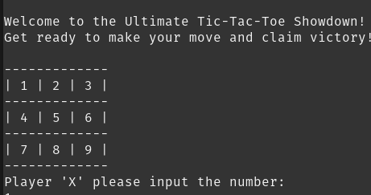
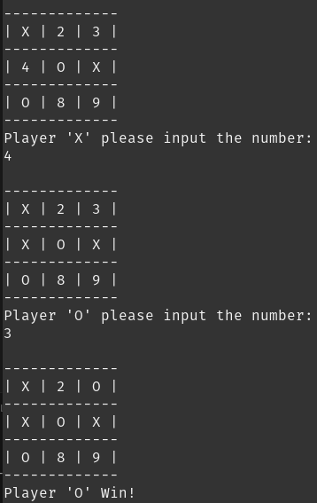

# 🎮 Tic Tac Toe in Rust  

This repository contains a simple **Tic Tac Toe** game implemented in Rust, created for **learning purposes**.

## 🖼️ Gameplay




## 🚀 Getting Started  

### 1. Clone the Repository  
```
git clone https://github.com/fahri-r/tic-tac-toe.git
cd tic-tac-toe-rust
```

### 2. Run the Game

Ensure you have Rust installed. Then, start the game with:

```
cargo run
```
